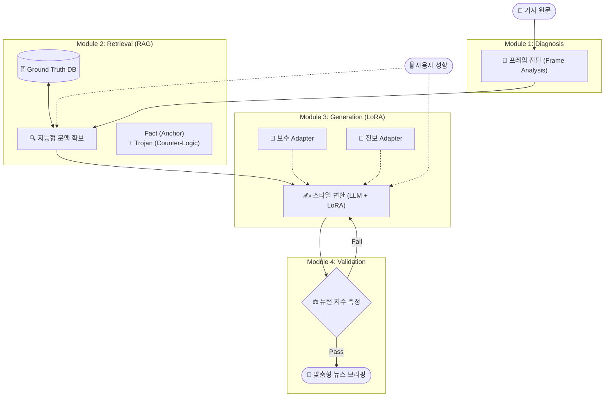

# 📰 News Fit (뉴스 핏)
### : 인지 편의성 기반 AI 뉴스 재구성 서비스
**(Cognitive Ease-based News Re-framing Service)**


> **"Fact는 그대로, View는 내 입맛대로."**
> 
> **News Fit**은 사용자의 정치 성향과 감정 상태에 맞춰 기사의 **프레임(Frame)**과 **어조(Tone)**를 재구성하여, 뉴스 회피 현상을 해소하고 정보 불균형을 해결하는 AI 뉴스 에디터입니다.

---

## 🧐 Project Background (기획 배경)

현대 사회의 많은 독자들은 **"나와 맞지 않는 기사가 주는 스트레스"** 때문에 뉴스를 아예 보지 않는 **뉴스 회피(News Avoidance)** 현상을 겪고 있습니다. 기존의 추천 알고리즘은 편향된 기사만 보여주어 **필터 버블(Filter Bubble)**을 심화시킬 뿐입니다.

**News Fit**은 이 문제를 해결하기 위해 다음과 같은 접근을 시도합니다:

1.  **Personalization (맞춤 변환):** 읽기 싫은 뉴스를 사용자가 선호하는 문체로 변환하여 진입 장벽을 낮춥니다.
2.  **Fact Anchoring (팩트 고정):** RAG 기술을 통해 원문의 핵심 팩트는 100% 보존합니다.
3.  **Trojan Horse Strategy (트로이 목마):** 편안한 문체 속에 **반대 진영의 핵심 논거**를 은밀하게 포함하여 균형 잡힌 시각을 유도합니다.

---

## 🏗️ System Architecture (시스템 구조)

본 프로젝트는 **진단(Diagnosis) → 재료 확보(Retrieval) → 생성(Generation) → 검증(Validation)**의 4단계 파이프라인으로 구성됩니다.



---

## 🧩 Core Modules (핵심 모듈)

| 모듈 | 파일 | 역할 | 사용 모델/기술 |
|---|---|---|---|
| **1. Frame Analyzer** | `src/frame_analyzer.py` | 기사의 주제(의대 증원 / 최저임금)와 현재 프레임을 진단하고, 반대 논리(트로이 목마) 검색 태그를 결정 | Zero-shot Classification (`facebook/bart-large-mnli`) |
| **2. RAG Engine** | `src/rag_engine.py` | Ground Truth DB에서 주제별 **팩트(Fact Anchor)**와 **반대 진영 논거(Trojan Horse)**를 메타데이터 필터링으로 검색 | ChromaDB + `jhgan/ko-sbert-nli` |
| **3. Style Generator** | `src/generator.py` | 사용자 성향에 맞는 LoRA 어댑터를 **Hot-Swapping**하고, CoT(단계별 사고) 프롬프트로 기사를 재작성 | `Qwen/Qwen2.5-1.5B-Instruct` + PEFT LoRA |
| **4. Newton Validator** | `src/validator.py` | 생성된 기사의 **감정 격앙도**와 **정치 편향도**를 측정하여, 기준(격앙도 90% 미만) 미달 시 재생성 루프 실행 | `matthewburke/korean_sentiment` |

### 파이프라인 동작 (app.py)

1. 사용자가 사이드바에서 정치 성향(`progressive` / `neutral` / `conservative`)을 선택하고 기사 원문을 입력합니다.
2. **진단:** Frame Analyzer가 기사의 주제와 프레임을 판별합니다.
3. **검색:** RAG Engine이 해당 주제의 팩트와 반대 논거를 DB에서 가져옵니다.
4. **생성 & 검증:** 성향별 LoRA 어댑터로 기사를 재작성하고, Newton Validator의 검증을 통과할 때까지 최대 2회 재시도합니다.
5. **출력:** 변환된 뉴스 브리핑과 함께 **뉴턴 지수 대시보드**(편향도·격앙도)와 트로이 목마 작동 여부를 표시합니다.

---

## 📁 Project Structure (프로젝트 구조)

```
news-fit-mvp/
├── app.py                          # Streamlit 메인 앱 (파이프라인 오케스트레이션)
├── requirements.txt
├── src/
│   ├── frame_analyzer.py           # Module 1: 프레임 진단
│   ├── rag_engine.py               # Module 2: RAG 검색
│   ├── generator.py                # Module 3: LoRA 스타일 변환
│   └── validator.py                # Module 4: 뉴턴 지수 검증
├── models/
│   ├── train_lora.py               # LoRA 어댑터 학습 스크립트 (QLoRA 지원)
│   ├── adapter_conservative/       # 🔴 보수 성향 어댑터
│   └── adapter_progressive/        # 🔵 진보 성향 어댑터
└── data/
    ├── crawrler/
    │   └── news_crawler.py         # 네이버 뉴스 API 크롤러
    ├── ground_truth/
    │   ├── create_rag_data.py      # RAG용 데이터 생성
    │   └── setup_db.py             # ChromaDB 구축 스크립트
    ├── ground_truth.json           # 팩트/논거 원본 데이터
    ├── ground_truth_db/            # ChromaDB 저장소
    └── raw/raw_text_for_lora/      # LoRA 학습용 성향별 사설 텍스트
```

---

## 🚀 Getting Started (실행 방법)

### 1. 환경 설정

```bash
git clone https://github.com/alfks/news-fit-mvp.git
cd news-fit-mvp
pip install -r requirements.txt
```

### 2. (선택) 데이터 수집

네이버 뉴스 API를 사용하려면 프로젝트 루트에 `.env` 파일을 생성하세요:

```env
NAVER_CLIENT_ID=your_client_id
NAVER_CLIENT_SECRET=your_client_secret
```

```bash
python data/crawrler/news_crawler.py
```

### 3. Ground Truth DB 구축

```bash
python data/ground_truth/create_rag_data.py   # ground_truth.json 생성
python data/ground_truth/setup_db.py          # ChromaDB 임베딩 및 적재
```

### 4. (선택) LoRA 어댑터 학습

`models/train_lora.py` 상단의 `PERSONA_TYPE`(`conservative` / `progressive`)을 설정한 뒤 실행합니다. GPU 환경에서는 4bit 양자화(QLoRA)로, CPU 환경에서는 일반 학습으로 자동 전환됩니다.

```bash
python models/train_lora.py
```

> 학습된 어댑터가 `models/adapter_conservative/`, `models/adapter_progressive/`에 이미 포함되어 있어 이 단계는 건너뛸 수 있습니다.

### 5. 앱 실행

```bash
streamlit run app.py
```

---

## 🛠️ Tech Stack (기술 스택)

| 분류 | 기술 |
|---|---|
| **Base LLM** | Qwen2.5-1.5B-Instruct |
| **Fine-tuning** | PEFT (LoRA, r=16) + TRL SFTTrainer, QLoRA(4bit) 지원 |
| **RAG** | ChromaDB (PersistentClient) + ko-sbert-nli 임베딩 |
| **NLP 분석** | BART-large-MNLI (Zero-shot), Korean Sentiment Classifier |
| **Frontend** | Streamlit |
| **Data** | 네이버 뉴스 검색 API + BeautifulSoup4 |

---

## ⚠️ MVP Limitations (현재 한계)

- 지원 주제는 **의대 증원**, **최저임금** 2개로 제한되어 있습니다.
- 정치 편향도 측정은 MVP 단계로, 현재 더미 로직을 사용합니다. (추후 학습된 KoBERT 분류기로 교체 예정)
- 생성 모델은 CPU 추론 기준으로 설정되어 있어 응답 속도가 느릴 수 있습니다.
